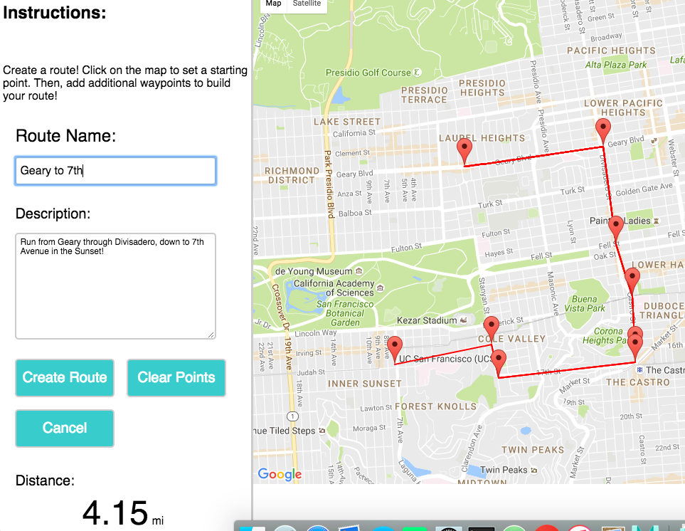
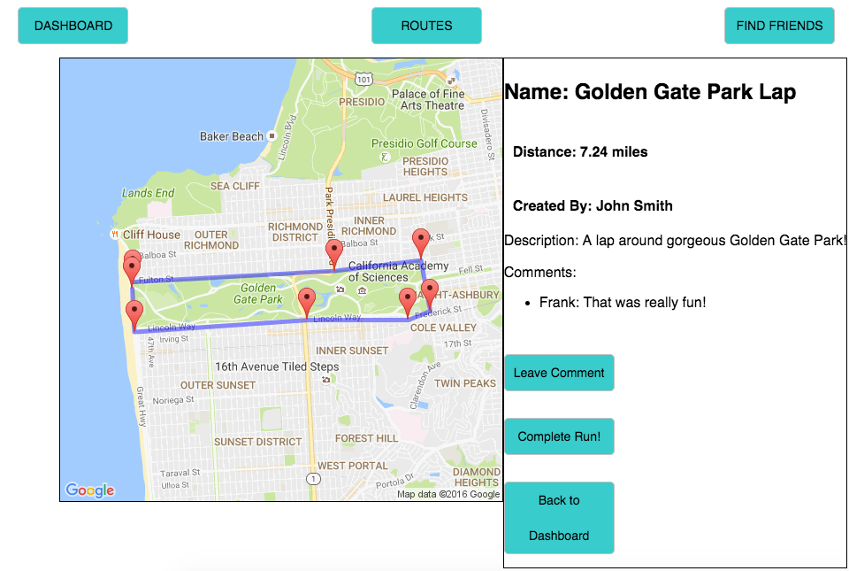
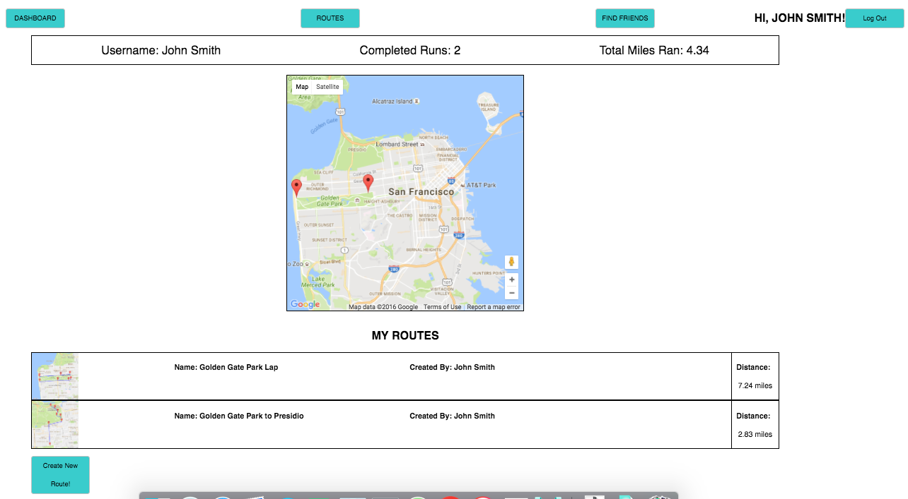

# Runnr

[Runnr Live][heroku]

[heroku]: www.runnr.site


Runnr is a full-stack web application inspired by the MapMyRun app. It utilizes Ruby on Rails on the backend, a PostgresSQL database, and React.js with a Redux architectural framework on the frontend.

## Features and Implementation


### Route Creation and Storage

Runnr allows users to create run routes by clicking a google map to set waypoints. At each waypoint, Runnr calculates the total run's distance and generates a polyline between each waypoint. The map data then gets saved to PostgresSQL as an image url, which can be accessed upon request.





#### Single-Page App

Runnr is a single-page application, with all the routers set up to render different React components upon different requests. The root static page keeps track of authenticication and only allows users to have access to the core functionalities of the app upon valid login or account creation.

```javascript
  <Router history={hashHistory}>
        <Route path="/" component={App} >
          <IndexRoute component={Splash}/>
          <Route path="/dashboard" component={DashboardContainer} onEnter={_ensureLoggedIn}/>
          <Route path="/login" component={SessionFormContainer}onEnter={_redirectIfLoggedIn} />
          <Route path="/signup" component={SessionFormContainer} onEnter={_redirectIfLoggedIn} />
          <Route path="/routes" component={SearchContainer} onEnter={_ensureLoggedIn}/>
          <Route path="/routes/new" component={CreateFormContainer} onEnter={_ensureLoggedIn} />
          <Route path="/routes/:routeId" component={RouteDetailContainer} onEnter={_getAllRoutes}>
            <Route path="comment" component={CommentFormContainer} onEnter={_ensureLoggedIn}></Route>
          </Route>
          <Route path="/find_friends" component={FindFriendsContainer} onEnter={_ensureLoggedIn} />
          <Route path="/friends" component={FriendsContainer} onEnter={_ensureLoggedIn} />
          <Route path="/profile" component={ProfileContainer} onEnter={_ensureLoggedIn} />
      </Route>
      </Router>
```

### Dashboard

Runnr also keeps track of runs that each user created. It also keeps track of the number of runs a user has completed, as well as the total distance the user has run over the course of all of his or her completed runs.



#Social Media

Users can also access other users' created runs and complete them. They can also leave comments on runs to share their experiences, as well as follow other users.

##Future Directions of the Project

In addition to the features already implemented, I plan on adding additional features to this project, listed below:

### Additional User Interaction

Users will be able to add other users' runs to their personal dashboards. These will be displayed as different colored markers on the user's dashboard map.

### Expansion to other Locations

Currently, Runnr was designed for the city of San Francisco. As more users from around the state, country, or world join and add their own runs, it will be necessary to provide location filters to help users find routes in their own locations.
